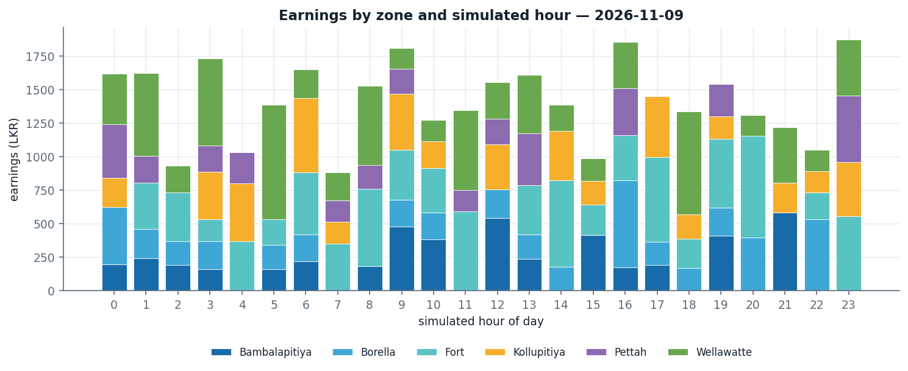
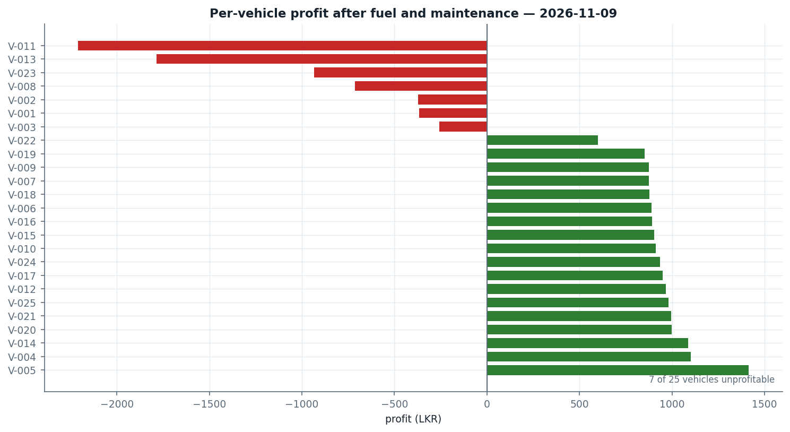
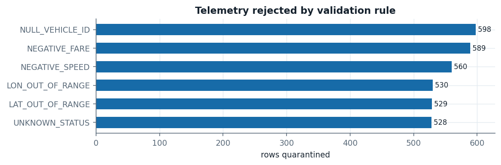
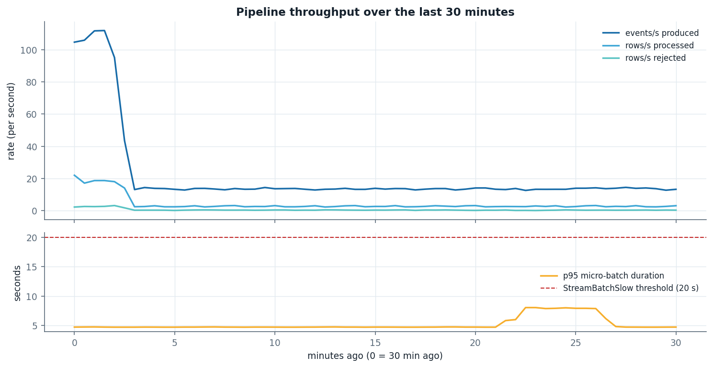
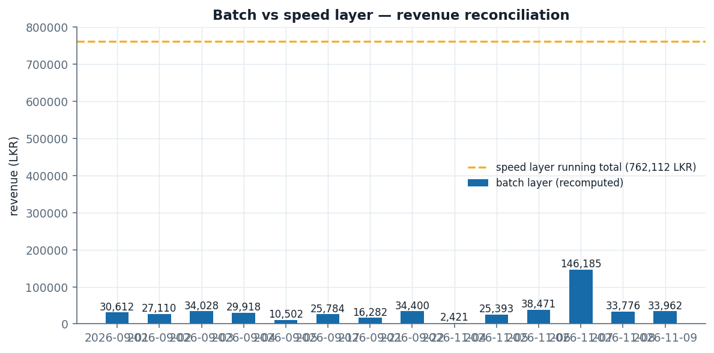

# Ride-Hailing Fleet Operations: A Lambda Architecture Data Pipeline

**Module:** Applied Big Data Engineering — Mini Project (25% of module grade)
**Student:** `<<NAME>>` (`<<STUDENT_ID>>`)
**Submission date:** `<<DATE>>`
**Repository:** `fleet-lambda`
**Deadline:** 28 September 2026

---

## Table of contents

1. [Executive summary](#1-executive-summary)
2. [Use case and business requirements](#2-use-case-and-business-requirements)
3. [Assumptions and the simulated clock](#3-assumptions-and-the-simulated-clock)
4. [Architecture decision: Lambda vs Kappa](#4-architecture-decision-lambda-vs-kappa)
5. [System architecture](#5-system-architecture)
6. [Technology stack and justification](#6-technology-stack-and-justification)
7. [Implementation](#7-implementation)
8. [Observability design](#8-observability-design)
9. [Results](#9-results)
10. [Limitations, trade-offs and production-scale changes](#10-limitations-trade-offs-and-production-scale-changes)
11. [Conclusion](#11-conclusion)
12. [References](#12-references)
13. [Appendices](#13-appendices)

---

## 1. Executive summary

This report describes the design, implementation and evaluation of an end-to-end big-data
pipeline for a ride-hailing fleet operator in Colombo, Sri Lanka. The system answers one
operational question with two halves:

> *What is fleet utilization and earnings by area/time-of-day right now, and which vehicles are
> becoming unprofitable once yesterday's fuel and maintenance costs are factored in?*

The two halves have genuinely different latency requirements. "Right now" must be answered in
seconds from a continuous GPS telemetry stream. "Which vehicles are unprofitable" cannot be
answered faster than daily, because the cost data arrives once a day as a file. That asymmetry is
the central fact of the design and is why the chosen architecture is **Lambda**, with **Kappa**
considered and rejected for reasons set out in Section 4.

The implemented system comprises eleven containerised services. A Python producer simulates 25
vehicles as state machines, emitting telemetry every two seconds into Apache Kafka (six
partitions, keyed by `vehicle_id`). A Spark Structured Streaming job validates, de-duplicates and
enriches those events, then fans out into four independent sinks: an immutable Parquet master
dataset, one-minute windowed zone metrics, per-vehicle state with threshold-based idle alerts,
and a quarantine sink for invalid data. A second producer drops one expense CSV per simulated day
into a landing directory. An Apache Airflow DAG waits for that file, validates it row by row,
loads it, and launches a Spark batch job that **recomputes** revenue and utilisation from the
Parquet master dataset and joins it with the costs to produce per-vehicle profitability, a trend
classification, and a consolidated HTML/CSV report. PostgreSQL serves both layers; FastAPI and
Grafana expose them. Prometheus scrapes every service and evaluates ten alert rules.

The single most important engineering decision beyond the architecture choice itself is the
explicit mitigation of Lambda's best-known weakness. The speed layer and the batch layer do not
merely follow the same specification: they **import the same Python modules** for zone assignment
(`common/zones.py`) and validation (`common/schemas.py`), and an automated test asserts that the
Spark-SQL and pure-Python dialects of the validation rules produce identical results on identical
fixtures. The residual difference between the two layers is not hidden but *measured* by a
dedicated reconciliation test and explained in the daily report.

Testing found nineteen genuine defects, documented with root cause and fix in the accompanying test
report. The most instructive, DEFECT-001, is a case where a GPS point lying exactly on an
internal zone boundary was assigned by floating-point noise — meaning the same coordinate could
have been bucketed into different zones by the two layers. That is precisely the silent
divergence the shared-module design exists to prevent, and it was caught by a boundary test
rather than by inspection.

---

## 2. Use case and business requirements

### 2.1 The operator's problem

A mid-sized ride-hailing operator runs a fleet of vehicles across six operating zones in Colombo.
Two distinct people need answers from the same underlying event stream:

* A **dispatcher**, during the shift, needs to know where the fleet is under-utilised right now,
  so that idle vehicles can be repositioned toward demand. Their tolerance for staleness is
  seconds, and they will accept an approximate answer.
* A **fleet manager**, once a day, needs to know which specific vehicles are losing money after
  fuel and maintenance are accounted for. Their tolerance for staleness is a day, but they will
  not accept an approximate answer, because the output drives decisions about individual drivers
  and vehicles.

This is not an artificial split. It is the same distinction that motivates Lambda architectures
in practice: a *serving* need measured in seconds and an *accounting* need measured in days, over
one event stream plus a second, slower source.

### 2.2 Functional requirements

| ID | Requirement | Where it is satisfied |
|---|---|---|
| REQ-01 | Ingest a continuous telemetry stream from the fleet | `producers/gps_producer.py` → Kafka `fleet.telemetry` |
| REQ-02 | Ingest a daily batch file of per-vehicle costs | `producers/expense_producer.py` → `/data/landing/expenses_<D>.csv` |
| REQ-03 | Join the two sources to produce per-vehicle economics | `batch/profitability_job.py` (full outer join on `vehicle_id`) |
| REQ-04 | Aggregate utilisation and earnings over time windows, by area | `streaming/transforms.py::zone_window_metrics`, `batch/profitability_job.py::zone_hour_summary` |
| REQ-05 | Expose real-time fleet metrics through an API | `api/main.py` `/metrics/fleet`, `/metrics/zones` |
| REQ-06 | Raise a threshold alert when a vehicle is idle too long | `stream_job.py` sink (c) → `idle_alerts`, `api` `/alerts/idle` |
| REQ-07 | Produce a daily per-vehicle profitability report | `batch/report_builder.py` → HTML + CSV |
| REQ-08 | Structured logging across ingestion, processing and storage | `common/logging_setup.py`, used by every service |
| REQ-09 | At least one alert/health-check rule, with metrics | `monitoring/alert_rules.yml` (10 rules), `api` `/health` |
| REQ-10 | Reproducible, deterministic behaviour | `SEED`, `common/config.py`, idempotent writes |
| REQ-11 | Support replay and recomputation of a past day | Parquet master dataset + idempotent UPSERTs |
| REQ-12 | Handle bad data without losing it | `rejected_events`, `rejected_expenses`, Kafka DLQ |

### 2.3 Non-functional requirements

| ID | Requirement | Target | Rationale |
|---|---|---|---|
| NFR-01 | Speed-layer end-to-end latency | event → visible in PostgreSQL in **< 30 s** (p95) | A dispatcher repositioning vehicles needs sub-minute information; anything slower and the fleet has already moved. |
| NFR-02 | Batch-layer cadence | once per simulated day, completing in **< 5 min** | The cost file arrives daily; the report must be ready before the next working day begins. |
| NFR-03 | Correctness of the batch layer | exact; recomputed from raw events | The output names individual vehicles and drivers, so approximation is not acceptable. |
| NFR-04 | Reproducibility | re-running a day yields identical business results | Required for auditability and for correcting a day after a bug fix. |
| NFR-05 | Resource envelope | whole stack ≤ 8 GB Docker memory, single laptop | The project must be demonstrable without cluster infrastructure. |
| NFR-06 | Ingestion throughput headroom | ≥ 8× the baseline event rate | Fleet growth should not require re-architecting; measured in TC-NFR-004. |
| NFR-07 | Observability | every failure mode detected by at least one named rule | An undetected failure in a nightly pipeline is discovered by its consumers, which is too late. |

---

## 3. Assumptions and the simulated clock

### 3.1 Assumptions

1. **Vehicle identity is stable and shared.** Both sources identify a vehicle by the same
   `vehicle_id` (`V-001` …). A test asserts the two generators agree on the identifier set,
   because a silent mismatch would make the profitability join quietly lose rows.
2. **Exactly one fare per trip.** Revenue is emitted only on the `on_trip → idle` transition.
   This makes `SUM(fare)` correct in both layers without any de-duplication of partial fares.
3. **Costs are attributable to a whole day, not to a trip.** Fuel and maintenance arrive as a
   daily per-vehicle total, which is how a real operator's fuel-card and workshop systems export.
4. **The operating area is a fixed grid.** Zones are a 3 × 2 grid over the Colombo bounding box
   (lat 6.86–6.98, lon 79.84–79.90). A production system would use real polygon geofences; the
   grid keeps the mapping pure, deterministic and unit-testable, which is what matters for the
   architectural argument.
5. **Currency is LKR** throughout, and the fare model (base 150 LKR + 100 LKR/km) and cost model
   are calibrated so that the business question has a non-trivial answer (Section 7.2).
6. **Late data is bounded in practice but not in theory.** The speed layer accepts two minutes of
   lateness; anything later is recovered by the batch layer rather than lost.

### 3.2 The simulated clock, and why it exists

A daily batch layer cannot be demonstrated if a day takes 24 hours. The system therefore
compresses **one simulated day into `SIM_DAY_SECONDS` real seconds** (600 s = 10 real minutes by
default), so a marker can watch several complete daily cycles — including the Airflow
reconciliation, the profitability report, and the two-day trend rule — inside one sitting.

| Quantity | Value with defaults |
|---|---|
| 1 simulated day | 600 real seconds |
| 1 real second | 144 simulated seconds |
| 1 simulated hour | 25 real seconds |
| Simulation start | `2026-09-01T00:00:00Z` |

The epoch is pinned once, in `/shared/sim_epoch.txt` on a shared volume, written with `O_EXCL` so
that exactly one process can create it. Without this, each container would compute its own start
instant, the containers would disagree about which simulated day it is, and the Airflow sensor
would wait for a file the producer had named differently.

### 3.3 The dual-time design and its trade-off

Every telemetry event carries **two timestamps**, and choosing which one each component uses is a
deliberate design decision:

| Field | Clock | Used by | Why |
|---|---|---|---|
| `event_time` | real wall-clock UTC | Structured Streaming windows and watermarks; `vehicle_status`; idle alerts | Watermark semantics stay intuitive: a "2-minute watermark" really means two minutes of real tolerance for network and broker delay. The live dashboard advances at real-world speed. |
| `sim_ts`, `sim_date`, `sim_hour` | simulated | Parquet partitioning; time-of-day analysis; the daily report | A full 24-hour business profile exists after ten real minutes, and `sim_date` is a meaningful partition key for the batch layer. |

**The trade-off.** Because the two clocks run at different rates, quantities expressed in one do
not translate naively into the other, and two places in the system must handle this explicitly:

* **Utilisation in the batch layer** is reported in *simulated* minutes. One event accounts for
  `EMIT_INTERVAL_SEC` real seconds, which is `EMIT_INTERVAL_SEC × 144` simulated seconds, i.e.
  4.8 simulated minutes with the defaults. A vehicle's 300 events over a simulated day therefore
  sum to 1,440 minutes = 24 hours, which is the property that makes the report readable as an
  operations document.
* **"Trips in the last simulated hour"** in the API is a genuinely awkward quantity: one
  simulated hour is 25 real seconds, which is *below* the one-minute granularity of the speed
  layer's windows. Rather than silently returning zero, the API clamps the look-back to one whole
  window and reports the value it actually used in a `sim_hour_lookback_seconds` field. This was
  DEFECT-007; the honest fix was to expose the approximation rather than hide it.

A production system with a real clock would not need any of this, and the dual-time complexity is
therefore a cost of the *demonstration*, not of the architecture.

---

## 4. Architecture decision: Lambda vs Kappa

This is the most consequential decision in the project and is treated accordingly.

### 4.1 The two architectures in brief

**Lambda** (Marz and Warren, *Big Data*, 2015) splits processing into three layers. A **batch
layer** holds an immutable, append-only master dataset and recomputes batch views over all of it.
A **speed layer** processes only recent data to compensate for the batch layer's latency,
producing approximate real-time views. A **serving layer** merges the two for querying. Its
defining property is that the master dataset is the source of truth and every view is
*recomputable* from it.

**Kappa** (Kreps, *Questioning the Lambda Architecture*, 2014) observes that if the log itself is
retained long enough, the batch layer is redundant: reprocessing is just replaying the log
through a second instance of the same streaming job and swapping the output over. Its defining
property is that there is exactly one code path.

See `docs/diagrams/lambda_vs_kappa.png` for a side-by-side diagram of both as they would apply to
this use case.

### 4.2 Comparison against this use case

| Criterion | Lambda | Kappa | Which wins here |
|---|---|---|---|
| **Latency** | Speed layer serves seconds; batch layer serves daily. Both needs met natively. | Single path serves seconds; the daily need is met by the same path at no extra benefit. | **Tie on the live half.** Kappa gains nothing on the daily half because the *input* is daily. |
| **Replay / reprocessing** | Re-read one Parquet partition and re-run one job. Bounded, cheap, and a normal operation. | Replay the topic from an offset into a parallel job, then swap. Requires retention ≥ the replay horizon. | **Lambda.** Correcting one day means reading ~50 MB of Parquet, not replaying days of Kafka. |
| **Cost** | Two compute paths; but the batch path runs once a day for minutes. Storage is cheap columnar Parquet. | One compute path; but long Kafka retention makes the broker the storage system, which is the most expensive place to keep cold data. | **Lambda**, at this scale and on this budget. |
| **Consistency / correctness** | Batch view is exact and authoritative; speed view is explicitly approximate. The gap is visible and measurable. | One view, so no internal disagreement — but the view is only as correct as the stream processing was at the time. | **Split.** Kappa wins on internal consistency; Lambda wins on *correctability*, which is what this use case needs. |
| **Operational complexity** | Two engines to operate (Structured Streaming + Airflow-driven batch); two code paths to keep aligned. | One engine, one deployment. Simpler on paper. | **Kappa.** This is Lambda's real cost and it is not dismissed. |
| **Fit with a daily file source** | The file stays a file; a sensor waits for it; a batch job reads it. | The file must be pushed into a topic by a bespoke connector so that it can pretend to be a stream. | **Lambda, decisively.** |
| **Fit with team skills and timeline** | Requires Spark (both APIs) and Airflow — both standard, both taught, both heavily documented. | Requires confident stream-stream / stream-static join design and state-store sizing, which is the harder skill. | **Lambda**, for a time-boxed project that must be defended in a viva. |

### 4.3 Justification for Lambda, tied to this use case

Three properties of *this* problem make Lambda the right answer, and none of them is a general
argument that Lambda beats Kappa.

**1. The two latency requirements are genuinely different and both are hard requirements.**
Live utilisation is worthless if it is an hour old; profitability is worthless if it is wrong.
Lambda lets each requirement be met by a component optimised for it, and — importantly — lets the
speed layer be *deliberately approximate*. `realtime_zone_metrics.active_vehicles` uses
`approx_count_distinct` because a dispatcher does not care whether 17 or 18 vehicles are active,
but does care that the number is two seconds old. The batch layer recomputes the same quantity
exactly. In a Kappa design there is one number and it must satisfy both consumers, so it must be
exact, and the exact computation is the slower one.

**2. The second source is natively a file, and forcing it into a stream buys nothing.**
The expense CSV arrives once per day. Under Kappa it would have to be pushed into a Kafka topic
by a connector that must itself be written, deployed, monitored and made idempotent — added
operational surface so that a daily file can be consumed by a streaming join that will fire once
a day. Under Lambda it is a file that a `FileSensor` waits for, which is the mechanism designed
for exactly this. The sensor is also where the *missing-file* failure mode is detected (TC-FT-005);
in a Kappa design that failure would surface as "the topic went quiet", which is much weaker.

**3. Profitability must be complete, correctable and recomputable.**
Three things routinely go wrong with this data: GPS events arrive late (the simulator injects a
1% rate of 30–90 s delays specifically to exercise this), cost files are re-issued with
corrections, and analytics bugs are found after the fact. Lambda handles all three the same way:
the master dataset is immutable and complete, so the affected day is simply recomputed and the
idempotent UPSERT converges on the corrected answer. TC-FT-007 demonstrates this by replaying a
reconciled day and asserting that every business column is byte-identical. Under Kappa, the same
correction means replaying a long-retention topic into a parallel job and cutting over — heavier,
slower, and considerably harder to defend as "obviously correct".

### 4.4 The rejected alternative: how Kappa would have worked

Kappa for this use case is entirely buildable, and it is worth stating concretely rather than
dismissing it:

* The GPS stream is unchanged: `fleet.telemetry`, six partitions, keyed by `vehicle_id`.
* The daily CSV is pushed into a compacted `fleet.expenses` topic keyed by
  `(report_date, vehicle_id)`, by a small connector (Kafka Connect FileStreamSource, or a custom
  producer triggered by a file watcher).
* Profitability becomes a **stream-static join** — the telemetry stream joined against a
  `fleet.expenses` KTable — or a **stream-stream join** with a one-day window if strict
  event-time alignment is required.
* Retention on `fleet.telemetry` is raised from 24 hours to weeks so that reprocessing is
  possible at all. Kafka's storage becomes the master dataset.
* Reprocessing means starting a second consumer group from offset 0, writing to a shadow table,
  and swapping the serving layer over when it catches up.

**Its genuine advantages**, which this project gives up:

* **One code path.** There is exactly one definition of "revenue", so the two layers cannot
  disagree — the entire class of bug this project has to actively defend against simply does not
  exist.
* **One operational surface.** No Airflow, no `spark-submit`, no second scheduler, no second set
  of failure modes.
* **Simpler mental model** for a new engineer: everything is a stream.

**Why it was rejected here:**

* The daily file gains nothing from becoming a stream, and costs a connector plus its failure
  modes.
* Long retention makes the broker the system of record for cold data — the most expensive and
  least query-friendly place to put it. Parquet on object storage is an order of magnitude
  cheaper and supports partition pruning, which the batch job relies on.
* Reprocessing one day would mean replaying every day since retention began, because Kafka
  offsets are not partitioned by business date. The Parquet lake is partitioned by `sim_date`, so
  recomputing one day reads exactly that day.
* A stream-stream join with a one-day window requires a state store holding a day of telemetry
  per key — which at 25 vehicles is trivial but at fleet scale is the dominant operational
  concern, and it would have to be sized and defended.

### 4.5 Honest trade-offs of the chosen design, and how they are mitigated

| Trade-off | Mitigation in this project | Evidence |
|---|---|---|
| **Two code paths can silently diverge.** | Zone assignment and validation are defined **once** in `common/zones.py` and `common/schemas.py` and imported by both layers. The validation rules exist in two dialects (pure Python and a Spark `Column`) only for performance, and a test asserts they agree on identical fixtures. | TC-STR-002, TC-STR-014 |
| **Duplicated compute.** | The batch layer processes one simulated day (tens of thousands of rows) in minutes, once per day. The duplication is real but its absolute cost at this scale is negligible, and it buys exactness. | TC-NFR-001, `pipeline_runs.duration_s` |
| **Eventual consistency between the layers.** | The difference is not hidden. TC-E2E-002 measures it, and the daily report prints both totals with an explanation of the three causes (watermark drops, `approx_count_distinct`, window/day boundary misalignment). | §9.5, `report_builder.py` §6 |
| **More moving parts to operate.** | Every service has a Docker healthcheck, a Prometheus scrape target, and at least one alert rule; orchestration failures land in `pipeline_alerts` alongside metric alerts. | §8, `monitoring/alert_rules.yml` |

---

## 5. System architecture

The full diagram is `docs/diagrams/architecture.png`.

### 5.1 Data flow: one telemetry event

1. `FleetSimulator.tick()` advances a vehicle's state machine and produces an event dictionary
   carrying both clocks.
2. With probability `BAD_EVENT_RATE` the event is deliberately corrupted; with probability
   `LATE_EVENT_RATE` its `event_time` is shifted 30–90 s into the past; with probability
   `DUPLICATE_RATE` it is sent twice.
3. `gps_producer` publishes it to `fleet.telemetry` with `key = vehicle_id`, `acks=all` and
   `enable.idempotence=true`. `event_id`, `status` and `run_id` travel as message headers so an
   operator can trace a single event with `kafka-console-consumer` without parsing the payload.
4. The delivery callback fires when the **broker acknowledges**, incrementing
   `producer_events_sent_total` and setting `producer_last_send_timestamp`. Counting
   acknowledgements rather than enqueues is what makes `NoTelemetryReceived` meaningful.
5. Spark's Kafka source reads the message. `parse_kafka_json` extracts typed columns and *keeps
   the Kafka coordinates* (`partition`, `offset`) so a quarantined row can be traced back.
6. `split_valid_invalid` partitions the batch. Invalid rows go to `rejected_events` **and** the
   DLQ topic; valid rows continue. Nothing is dropped, so the reject rate in the report is a true
   fraction of ingested rows.
7. `deduplicate` removes repeated `event_id`s within the two-minute watermark.
8. `enrich` adds `zone` (via the shared function), `is_active` and `is_trip_end`.
9. The enriched stream feeds three sinks concurrently, each with its own checkpoint.

### 5.2 Data flow: one daily file

1. At the end of simulated day *D*, `expense_producer` generates one row per vehicle plus
   `EXPENSE_DIRTY_ROWS` deliberately invalid rows, writes them to
   `.expenses_<D>.csv.tmp` **in the same directory**, `fsync`s, and `os.replace`s onto the final
   name. Same directory matters: `os.replace` is only atomic within one filesystem.
2. The Airflow `FileSensor` (`mode="reschedule"`, 15 s poke, one-simulated-day timeout) observes
   the file. Because the write was atomic it can never see a partial file.
3. `validate_expense_file` checks every row with the shared validator, writes failures to
   `rejected_expenses`, and **fails the run** if more than `MAX_BAD_EXPENSE_ROW_PCT` are invalid.
4. `load_expenses_to_postgres` upserts the good rows on `(report_date, vehicle_id)`.
5. `check_master_data_available` asserts the Parquet partition for *D* exists and is non-empty,
   so a missing partition produces a clear message rather than a Spark stack trace.
6. `run_profitability_job` `spark-submit`s the batch job as a separate process.
7. `build_daily_report` renders the HTML and CSV; `data_quality_checks` asserts business
   invariants; `record_pipeline_run` writes the audit row.

### 5.3 Kafka topic and partition design

| Decision | Value | Rationale |
|---|---|---|
| Topic | `fleet.telemetry` | One topic, one event type. A schema registry would be the next step at scale. |
| Partitions | **6** | Two to three times the current consumer parallelism, so consumers can be scaled out without re-partitioning (which would break key-to-partition stability). Small enough that each partition carries useful volume rather than being mostly empty. |
| Key | **`vehicle_id`** | Kafka guarantees ordering *within a partition*. Keying by vehicle guarantees a vehicle's `idle → enroute → on_trip → idle` sequence can never be observed out of order, which the `idle_since` state logic depends on. It also gives even distribution: 25 vehicles across 6 partitions. |
| Replication | 1 | Single-broker demo. Stated as a limitation in §10. |
| Retention | 24 h telemetry, 72 h DLQ | Long enough to replay a full run into the stream job; short enough for a laptop disk. The DLQ keeps data longer because bad events are the evidence for the data-quality report. |
| DLQ | `fleet.telemetry.dlq`, 1 partition | Ordering is irrelevant for quarantined data; one partition keeps it simple. |
| Auto-create | **disabled** | Partition count is an architectural decision, not something to leave to a broker default. |

TC-INT-001 asserts both properties empirically: all six partitions receive data, and no key ever
appears in more than one partition.

### 5.4 Storage schema

Ten tables and three views (`sql/init.sql`, fully commented; ERD in
`docs/diagrams/data_model.png`). The organising principle is that **every table a pipeline writes
has a natural primary key**, so every write can be `INSERT … ON CONFLICT DO UPDATE`.

| Table | Layer | Primary key | Purpose |
|---|---|---|---|
| `realtime_zone_metrics` | speed | `(window_start, zone)` | 1-minute tumbling window aggregates |
| `vehicle_status` | speed | `vehicle_id` | latest state per vehicle; carries `idle_since` |
| `idle_alerts` | speed | `id`, **partial unique on `vehicle_id` where `status='open'`** | one open alert per vehicle, guaranteed by the index |
| `rejected_events` | speed | `id` | quarantine with reason + Kafka coordinates |
| `daily_expenses` | batch | `(report_date, vehicle_id)` | validated cost rows |
| `rejected_expenses` | batch | `id` | quarantine for the CSV |
| `daily_vehicle_profitability` | batch | `(report_date, vehicle_id)` | **the answer** |
| `daily_zone_summary` | batch | `(report_date, zone, sim_hour)` | exact zone × time-of-day view |
| `pipeline_runs` | orchestration | `run_id` | audit trail, read by Grafana |
| `pipeline_alerts` | orchestration | `id` | orchestration failures |

Views: `v_fleet_now` (fleet snapshot), `v_unprofitable_vehicles` (latest reconciled day),
`v_data_quality_today`.

Two schema decisions are worth defending:

* **`idle_alerts` uses a partial unique index**, not application logic, to enforce "at most one
  open alert per vehicle". Because the constraint lives in the database, replaying a micro-batch
  cannot create duplicate alerts no matter what the application does. This is what makes the
  alert insert genuinely idempotent.
* **`v_fleet_now` takes vehicle counts from `vehicle_status`, not from summing
  `realtime_zone_metrics`.** Summing per-zone distinct counts double-counts a vehicle that
  crossed a zone boundary within the window — it produced `active + idle > total` before the fix
  (DEFECT-006). The exact current state lives in `vehicle_status`; the window supplies the money
  and trip figures, which *are* additive.

---

## 6. Technology stack and justification

Each choice is justified against a constraint of this use case, with the alternative considered.

### 6.1 Messaging — Apache Kafka 3.7 (KRaft mode)

**Constraint:** two consumers with different needs (a streaming job and, potentially, a replay
job) must read the same events independently, and per-vehicle ordering must be guaranteed.

Kafka's consumer-group model lets the speed layer and any replay job consume the same topic at
different offsets without coordination, and per-partition ordering plus keyed partitioning gives
per-vehicle ordering for free. KRaft mode removes the ZooKeeper container, which matters directly
against NFR-05 (memory envelope).

**Alternative considered — RabbitMQ.** Rejected because it is a queue, not a log: once a message
is acknowledged it is gone, so replay — the property the entire batch layer depends on — would
have to be built separately. **Alternative considered — Redis Streams.** Rejected on durability:
retention is memory-bound, which conflicts with keeping a day of telemetry.

### 6.2 Stream processing — PySpark 3.5.3 Structured Streaming, `local[*]`

**Constraint:** the same engine, language and semantics must serve both the streaming and the
batch layer, so that the two code paths can share modules (§4.5).

This is the decisive argument. Structured Streaming's DataFrame API is the *same* API as Spark's
batch API, so `common/zones.py` and the validation rules are literally the same code in both
layers. Event-time windowing with watermarks is a first-class feature, and `foreachBatch` gives
an escape hatch to arbitrary sink logic — which is what makes idempotent PostgreSQL UPSERTs
possible at all.

**Alternative considered — Apache Flink.** Genuinely better at pure streaming: true per-event
processing rather than micro-batches, richer state primitives, and it is the natural engine for a
Kappa design. Rejected because the architecture chosen is Lambda, where sharing code with the
batch layer matters more than per-event latency; because micro-batch latency (seconds) already
satisfies NFR-01 with large margin; and because it would mean two engines to operate.
**Alternative considered — Apache Storm.** Rejected as a generation behind: no built-in
event-time windowing or watermarks, no DataFrame API, and no batch counterpart, so every
transformation would have to be written twice.

### 6.3 Batch processing — the same PySpark, launched by `spark-submit`

Running the batch job as a **separate process** rather than inside the Airflow worker means a
Spark failure (including an OOM) cannot take the scheduler down with it; the exit code is the
contract. Partition pruning on `sim_date` means recomputing one day reads only that day.

### 6.4 Orchestration — Apache Airflow 2.9.3, LocalExecutor

**Constraint:** the batch layer's real dependency is an external file that may be late or absent,
and that condition must be waited on, timed out, and alerted about.

Airflow's `FileSensor` with `mode="reschedule"` releases its worker slot between pokes, so a
sensor waiting most of a simulated day costs nothing. Task-level retries, `on_failure_callback`
and XCom give the DAG its error handling and data passing without custom code. LocalExecutor (not
Celery) avoids a message broker and worker pool for a DAG with `max_active_runs=1`.

**Alternative considered — a `cron` container.** Rejected because it provides no sensor
semantics, no retries, no per-task observability and no run history — `pipeline_runs` would have
to be hand-built. **Alternative considered — Dagster / Prefect.** Both are arguably nicer for
data-asset modelling, but Airflow is the industry default, is what the module teaches, and has
the deepest documentation for a viva defence.

### 6.5 Master dataset — Parquet on a Docker volume

**Constraint:** an immutable, complete, cheaply-retained, partition-prunable record of every
clean event.

Parquet is columnar and compressed, so scanning one day to sum fares reads a fraction of the
bytes a row store would. `partitionBy("sim_date")` makes "read exactly day D" a directory listing
rather than a filter over everything.

**Alternative considered — keeping the master dataset in PostgreSQL.** Rejected because it
conflates the immutable source of truth with the mutable serving store; the separation is
precisely what makes recomputation possible. **Alternative considered — Delta Lake or Apache
Iceberg.** These are the right answer at scale (ACID commits, schema evolution, time travel) and
are named as the production upgrade in §10. Rejected here only because they add a substantial
dependency for properties this single-writer demo does not exercise.

### 6.6 Serving store — PostgreSQL 16

**Constraint:** the serving layer must support `ON CONFLICT DO UPDATE` (the idempotency
mechanism), joins and aggregates (the profitability report), and a partial unique index (the
one-open-alert-per-vehicle guarantee).

All three are PostgreSQL features and none is available in a typical wide-column store. The data
volume is tens of thousands of rows, so write scalability is simply not the binding constraint.

**Alternative considered — Apache Cassandra.** Rejected: it trades exactly the features this
workload needs (joins, aggregates, transactional upserts) for write scalability this workload
does not need. **Alternative considered — TimescaleDB / ClickHouse / Druid.** Better for the
time-series half at 10–100× the volume, and named in §10 as the scale-up path; rejected here as
premature optimisation that would add a second store to operate.

### 6.7 Serving API — FastAPI + Uvicorn + psycopg 3

Pydantic response models make `/docs` a genuine contract rather than a guess, and each model
carries a `source_layer` field so the Lambda split is visible from outside the system. The service
holds no Spark or JVM dependency, so it is a ~300 MB image that starts in under a second and could
be scaled horizontally on its own.

### 6.8 Observability — Prometheus 2.53, Grafana 11, kafka-exporter, JSON logs

Prometheus's pull model means a service that dies stops being scraped, which is itself the signal
(`TargetDown`). Consumer lag comes from `kafka-exporter` rather than the application, because lag
is a broker-side fact a producer cannot know. Grafana datasources and dashboards are
**provisioned from disk**, so a clean `make up` yields working dashboards with no manual clicking.

### 6.9 Version pinning

Every image tag and Python package is pinned (`docker-compose.yml`, `requirements*.txt`). The
Spark–Kafka connector jars are **baked into the images at build time** rather than resolved with
`--packages` at submit time, because Maven resolution on every container start is slow and is a
single point of failure during a live demonstration.

---

## 7. Implementation

### 7.1 Producers

`producers/fleet_simulator.py` holds the state machine and is deliberately free of any socket,
client or wall-clock dependency, which is what makes the interesting behaviour testable in
milliseconds:

```python
ALLOWED_TRANSITIONS = {
    IDLE:    (IDLE, ENROUTE),
    ENROUTE: (ENROUTE, ON_TRIP),
    ON_TRIP: (ON_TRIP, IDLE),
}
```

`enroute` exists as a separate state from `on_trip` because it is *active but unpaid* — the
distinction that makes "utilisation" more interesting than "is the engine running", and it is
carried through to the report.

The fare rule is the load-bearing simplification:

```python
# ON_TRIP
vehicle.trip_distance_km += self._move(vehicle, dt_s)
if vehicle.dwell_remaining_s <= 0:
    fare = self.compute_fare(vehicle.trip_distance_km)   # ONLY here
    vehicle.status = IDLE
```

A fare is emitted on exactly one event per trip, so `SUM(fare)` is correct in both layers with no
risk of double counting — which is what makes the reconciliation in §9.5 meaningful.

**Fault injection** is configuration, not code: `BAD_EVENT_RATE`, `LATE_EVENT_RATE`,
`DUPLICATE_RATE` and `LAZY_VEHICLES`. Without them, the validation, watermark, dedup and alerting
paths could not be demonstrated at all.

`producers/expense_producer.py` writes atomically:

```python
tmp = target.with_name(f".{target.name}.tmp")
with tmp.open("w", newline="", encoding="utf-8") as handle:
    writer.writeheader(); writer.writerows(payload)
    handle.flush(); os.fsync(handle.fileno())
os.replace(tmp, target)      # atomic within one filesystem
```

### 7.2 Cost calibration

Cost levels are configuration (`EXPENSE_*` in `.env`), calibrated so the business question has a
non-trivial answer. Fuel is `distance × 45 LKR/km` (Sri Lankan petrol at roughly 370 LKR/l and
8 km/l); ordinary maintenance is 80–420 LKR/day; `EXPENSE_HIGH_COST_PCT` (15%) of vehicles draw
1,500–4,200 LKR with `service_flag = 1`. Combined with the "lazy" vehicles' low revenue, this
yields a mix of comfortably profitable, marginal and loss-making vehicles. Without calibration
the answer would be degenerate — all profitable or none — and the report would say nothing.

### 7.3 Speed layer

Four independent queries, four checkpoint directories. A failure or a code change in one sink
cannot corrupt or stall the others, and each resumes from exactly where it stopped.

De-duplication uses the watermarked variant, and the reason is state growth:

```python
watermarked = df.withWatermark("event_time", f"{minutes} minutes")
if df.isStreaming and hasattr(watermarked, "dropDuplicatesWithinWatermark"):
    return watermarked.dropDuplicatesWithinWatermark(["event_id"])
return watermarked.dropDuplicates(["event_id"])
```

Plain `dropDuplicates` retains every seen key forever; the watermarked version expires them,
bounding state at "one watermark's worth of event ids". The `isStreaming` guard exists because
the operator is streaming-only and raises on a bounded DataFrame (DEFECT-009) — the batch path is
semantically equivalent, so the unit tests exercise the same rule.

The window aggregation states the approximation explicitly:

```python
F.approx_count_distinct(F.when(F.col("is_active"), F.col("vehicle_id"))).alias("active_vehicles"),
...
F.round(F.col("idle_events") / F.greatest(F.col("event_count"), F.lit(1)), 4).alias("idle_ratio"),
```

`idle_ratio` is computed from **event counts, not vehicle counts**. A vehicle that goes
`idle → enroute` inside one window is legitimately in both distinct-vehicle counts, so
`idle_vehicles / total_vehicles` could exceed 1 (DEFECT-008). The event-count ratio is the
time-weighted share of the window spent idle — and it is also exactly how the batch layer defines
`utilization`, so after this change the two layers measure the same quantity and the
reconciliation is meaningful.

The idle-alert state machine lives entirely in one SQL statement, which is why it survives
restarts with no application state:

```sql
idle_since = CASE
    WHEN EXCLUDED.status = 'idle'
        THEN COALESCE(vehicle_status.idle_since, EXCLUDED.last_event_time)
    ELSE NULL
  END
...
WHERE EXCLUDED.last_event_time >= vehicle_status.last_event_time
```

`COALESCE` keeps `idle_since` "sticky" so the threshold measures the whole idle spell, not the
time since the last event; the trailing `WHERE` ensures a late event can never overwrite newer
state.

Output modes differ per sink on purpose. The Parquet sink must be `append`. The window aggregate
uses `update`, so an in-flight window is re-emitted with running totals every trigger and the
dashboard refreshes in 30 s instead of waiting out the two-minute watermark — which is only safe
because the write is an idempotent UPSERT on `(window_start, zone)`.

### 7.4 Batch layer

The batch job reads the Parquet partition directly (a prune, not a filter), recomputes, joins and
scores. Revenue is de-duplicated on the **business** key:

```python
paying = (events.where((F.col("fare") > 0) & F.col("trip_id").isNotNull())
                .select("vehicle_id", "trip_id", "fare")
                .dropDuplicates(["trip_id"]))
```

De-duplicating on `trip_id` rather than `event_id` is the stronger guarantee: it catches a
duplicate that arrived later than the speed layer's watermark and so was never removed upstream.

The join is a **full outer** join, so neither side can lose rows:

```python
.withColumn("data_quality_flag",
    F.when(F.col("total_events").isNull(),      F.lit("NO_TELEMETRY"))
     .when(F.col("distance_covered").isNull(),  F.lit("MISSING_EXPENSE"))
     .otherwise(F.lit("OK")))
```

A vehicle that drove but has no cost row is flagged, not dropped — dropping it would understate
fleet revenue *and* hide a data-quality problem. A cost row with no telemetry is equally
interesting: a vehicle costing money while producing nothing.

The profitability formulae, reproduced verbatim from the code:

| Quantity | Formula | Guard |
|---|---|---|
| `total_cost_lkr` | `fuel_cost + maintenance_cost` | — |
| `profit_lkr` | `revenue_lkr − total_cost_lkr` | — |
| `margin` | `profit_lkr / revenue_lkr` | NULL when `revenue = 0` |
| `cost_per_km` | `total_cost_lkr / distance_km` | NULL when `distance = 0` |
| `revenue_per_km` | `revenue_lkr / distance_km` | NULL when `distance = 0` |
| `utilization` | `active_events / max(total_events, 1)` | denominator clamped |
| `is_unprofitable` | `profit_lkr < 0` | — |

The "becoming unprofitable" rule uses two days of history:

* **`AT_RISK`** — `margin < MARGIN_THRESHOLD` on this day **and** the previous day.
* **`DECLINING`** — `margin(D) < margin(D−1) < margin(D−2)`.
* **`AT_RISK` takes precedence**: an absolute loss-making level is a stronger signal than a
  downward slope that may still be comfortably profitable. Insufficient history yields `STABLE`.

Each branch is pinned by a hand-calculated test (TC-BAT-007 … TC-BAT-011).

### 7.5 Airflow DAG

Task graph: `docs/diagrams/airflow_dag.png`. Three details are worth defending.

**The target date is computed in a task, not taken from `{{ ds }}`.** Airflow's logical date lives
on the real calendar; this pipeline lives on the simulated one, so the mapping must be explicit.
It is passed by XCom and can be overridden with `--conf '{"date": "…"}'` for a backfill.

**`retries=0` on the sensor only**, overriding the DAG default of 2. A sensor *timeout* is a
definitive "the file is not coming"; retrying it twice more would delay the alert by two further
simulated days without changing the outcome.

**Failures are recorded, not just logged.** `on_failure_callback` writes to `pipeline_alerts`, so
orchestration failures receive the same treatment as Prometheus metric alerts and appear on the
same Grafana dashboard.

### 7.6 API and report

The API reads only PostgreSQL. `/health` and `/health/live` are separate deliberately: if the
container healthcheck used the deep check, Docker would restart the API whenever PostgreSQL
hiccuped, converting a degraded read path into a full outage. Data freshness is part of the deep
check, because a pipeline whose dependencies are all "up" but which has not seen an event in five
minutes is not healthy — and that is exactly the state the chaos test produces.

The report (`batch/report_builder.py`) is a single self-contained HTML file plus a CSV, with six
sections mapping to REQ-05, REQ-07, REQ-04, REQ-06, REQ-12 and REQ-11. Every figure in it is the
result of one SQL statement listed at the top of the module; nothing is hard-coded.

---

## 8. Observability design

### 8.1 Signal → failure → threshold

The organising principle is that every signal exists to detect a **named failure**, not because
it was easy to emit.

| Signal | Failure it detects | Alert rule | Threshold rationale |
|---|---|---|---|
| `producer_last_send_timestamp` | Producer dead, or Kafka unreachable from the producer | `NoTelemetryReceived` | `> 120 s`, `for 30s`. Events are emitted every 2 s, so 120 s is ~60 missed cycles — far beyond any plausible GC pause or broker rebalance. |
| `stream_last_batch_timestamp` | Spark job crashed, stuck, or lost its consumer | `StreamProcessingStalled` | Same 120 s, kept **separate** so "no data produced" and "data produced but not processed" are distinguishable — a distinction Lambda's two layers make observable. |
| `stream_rows_rejected_total` / `…_processed_total` | Upstream schema change, or a fleet-wide GPS fault | `HighRejectRate` | `> 5%` over 2 m. Baseline injection is 2%, so 5% sustained means the real corruption rate more than doubled. |
| `stream_batch_duration_seconds` | Back-pressure | `StreamBatchSlow` | p95 `> 20 s` against a 30 s trigger: beyond this the job can never catch up. |
| `kafka_consumergroup_lag` | Consumer cannot keep up | `ConsumerLagHigh` | `> 5000` messages ≈ 6 minutes of backlog at ~12.5 events/s. |
| `expense_last_file_timestamp` | Batch source stopped | `ExpenseFileLate` | `> 1.5` simulated days: one whole day's file was missed, which is exactly the `SKIP_DAY` scenario. |
| `api_health_status` | Serving outage or stale data | `ApiUnhealthy` | `< 1` for 1 m. |
| `idle_alerts_open` | **Business** signal: fleet over-supplied for demand | `ManyVehiclesIdle` | `> 5` for 2 m. Included to show alerting on business KPIs, not only infrastructure. |
| `up` | A dead exporter | `TargetDown` | Without it, a dead exporter would silently stop every other rule evaluating. |

Note the deliberate redundancy: an ingestion outage is caught **twice**, by
`NoTelemetryReceived` (producer side) and by `/health` returning 503 on data freshness (serving
side). They fail for different reasons, so neither is a single point of blindness.

### 8.2 Logging schema

Every service emits one JSON object per line with a fixed envelope:

```json
{"ts":"2026-09-01T12:00:00.123+00:00","level":"INFO","service":"stream-job",
 "stage":"processing","event":"batch_complete","run_id":"2e5480c311b3",
 "message":"micro-batch complete","sink":"zone_metrics","batch_id":3,
 "rows_written":15,"duration_ms":1382.4,"zones":6}
```

`stage` is validated against `{ingestion, processing, storage, serving, orchestration}` at
configuration time, so a typo fails fast rather than producing an unfilterable log stream. One
`jq` filter therefore works across all eleven services.

### 8.3 Tracing-lite

Two identifiers make a single item followable across the whole system:

* **`event_id`** — generated by the producer, logged there, carried as a Kafka message header,
  stored in `rejected_events` if quarantined, and present in the stream job's logs.
* **`run_id`** — created by Airflow, passed to `spark-submit` as `--run-id`, written into
  `daily_vehicle_profitability.run_id`, `daily_expenses.run_id` and `pipeline_runs.run_id`, and
  attached to every log line those tasks emit.

A worked example of each is in §9.7.


### 8.4 What went wrong with the alerting, and what it teaches

The alert rules were the single most defect-dense part of this project: **five of the ten rules
were broken**, and every one of them was broken *silently*. Nothing errored, every metric name
existed in some exporter's output, and both Grafana dashboards rendered. The defects only surfaced
when the question changed from *"is the rule written correctly?"* to **"has this rule ever
actually had data, and has it ever actually fired for the right reason?"**

| Defect | The rule looked right because… | What was actually true |
|---|---|---|
| **DEFECT-013** | `kafka_consumergroup_lag` is a real metric that kafka-exporter really exports. | Structured Streaming keeps offsets in its **checkpoint**, not in a Kafka consumer group, so the broker had no group for this job and the series was permanently empty. |
| **DEFECT-014** | `producer_last_send_timestamp` existed and had a plausible value. | *Every* service exposed it, because they all import `common/metrics.py` and it registered into the default registry. An unset gauge reads **0**, so `time() - 0` fired three alerts permanently on phantom instances. |
| **DEFECT-015** | Both metrics in the ratio were real counters from the same job. | The numerator counted rejected **events**; the denominator counted rows written **per sink**. Different units, ~5× too high, permanently over threshold. |
| **DEFECT-016** | `api_health_status` was set by code that demonstrably worked. | It was set only inside the `/health` *request handler*, which Prometheus never calls — so it never left its initial 0. |
| **DEFECT-017** | The expression is the textbook staleness idiom. | Prometheus marks a stopped target's series **stale**, so `time() - <no data>` is an empty vector. The rule could fire for a producer that was alive-but-silent, and *never* for one that had died. |

Three lessons generalise beyond this project, and they are the part of the observability work worth
defending:

1. **Two bugs can cancel out and look like a working alert.** Before DEFECT-014 was fixed, the
   phantom series kept `NoTelemetryReceived`'s expression non-empty, so it *did* fire when the
   producer stopped — for entirely the wrong reason. Fixing the phantom instances is what exposed
   DEFECT-017. An alert that fires is not evidence of an alert that works.
2. **Every `time() - <timestamp> > threshold` rule needs a companion `up == 0` or `absent()`
   clause.** The age form silently assumes the exporter is alive, which is exactly the assumption
   an outage violates. This is the dead man's switch, and its absence is the most common
   availability-alerting mistake.
3. **A gauge written only on request is a cache, not a signal.** If the only thing that updates a
   health metric is a human hitting an endpoint, the metric reports the last time someone asked,
   not the current state of the system.

This is also the strongest argument for the chaos suite existing at all. Every one of these five
defects was invisible to unit tests, to integration tests, and to reading the YAML — because the
rules are *correct as written* and only wrong in relation to what the metrics actually contain.
Only stopping a real container and asking "did the detector fire?" could find them. The suite's
value is not that it passes; it is that TC-FT-001 **failed**, and that failure was worth more than
the other six passes combined.

---

## 9. Results

> **Every figure, table and log excerpt in this section is copied from a file under
> `docs/evidence/`, captured from a real run by `scripts/collect_evidence.py`, and written
> into this document by `scripts/fill_report_results.py`. The capture timestamp is recorded
> inside each evidence file. Nothing here was typed by hand.**

### 9.1 Environment of the measured run

Captured `2026-09-26T03:08:07+00:00` (`docs/evidence/environment.json`).

| Item | Value |
|---|---|
| Host OS | Windows 11 Home 10.0.26200 |
| Docker Engine / Compose | 27.4.0 / v2.31.0-desktop.2 |
| Docker VM | 20 CPUs, WSL2 capped at 6 GB |
| Container Python | 3.11.16 |
| PySpark | 3.5.3 |
| Kafka / PostgreSQL / Airflow | 3.7.1 (KRaft) / 16-alpine / 2.9.3 |
| Prometheus / Grafana | 2.53.3 / 11.3.1 |
| Simulated clock | 1 day = 600 s real, start 2026-09-01 |
| Fleet | 25 vehicles, 3 lazy, emit every 2.0 s |
| Fault injection | bad 0.02, late 0.01, duplicate 0.01 |

Row counts at capture time (`docs/evidence/sql/table_row_counts.txt`):

```
table_name                  | rows
daily_expenses              | 400 
daily_vehicle_profitability | 700 
daily_zone_summary          | 1466
idle_alerts                 | 117 
pipeline_alerts             | 17  
pipeline_runs               | 20  
realtime_zone_metrics       | 895 
rejected_events             | 3334
rejected_expenses           | 64  
vehicle_status              | 25  
(10 rows)
```

### 9.2 Live API responses

`GET /metrics/fleet` (`docs/evidence/api/metrics_fleet.json`) — the live half of the
business question:

```json
{
  "source_layer": "speed",
  "window_start": "2026-09-26T03:07:00Z",
  "window_end": "2026-09-26T03:08:00Z",
  "active_vehicles": 17,
  "idle_vehicles": 8,
  "total_vehicles": 25,
  "idle_ratio": 0.32,
  "trips_last_hour": 1532,
  "earnings_last_hour_lkr": 296907.61,
  "trips_last_sim_hour": 0,
  "earnings_last_sim_hour_lkr": 0.0,
  "sim_hour_lookback_seconds": 60.0,
  "avg_speed_kmh": 39.1,
  "open_idle_alerts": 1,
  "data_age_seconds": 6.236742
}
```

`GET /health` (`docs/evidence/api/health.json`) — note that **data freshness is part of
health**, which is what makes the ingestion-outage scenario detectable from the serving
side as well as from Prometheus:

```json
{
  "status": "healthy",
  "checked_at": "2026-09-26T03:08:05.466445Z",
  "run_id": "d0e05f6df34b",
  "components": {
    "postgres": {
      "ok": true,
      "detail": null,
      "latency_ms": 5.79
    },
    "kafka": {
      "ok": true,
      "detail": null,
      "latency_ms": 1.75
    },
    "data_freshness": {
      "ok": true,
      "detail": "newest event is 6.2s old (threshold 120s)",
      "latency_ms": null
    }
  },
  "freshness_seconds": 6.17,
  "freshness_threshold_seconds": 120
}
```

### 9.3 Daily profitability — the answer to the business question

Per-day summary (`docs/evidence/sql/profitability_summary.txt`):

```
report_date | vehicles | trips | revenue   | cost     | profit    | unprofitable | at_risk
2026-09-01  | 25       | 159   | 30611.90  | 22747.82 | 7864.08   | 6            | 0      
2026-09-02  | 25       | 129   | 27110.08  | 21840.48 | 5269.60   | 7            | 3      
2026-09-03  | 25       | 179   | 34027.57  | 21657.18 | 12370.39  | 7            | 5      
2026-09-04  | 25       | 151   | 29917.62  | 23749.05 | 6168.57   | 6            | 6      
2026-09-05  | 25       | 14    | 10501.93  | 24503.40 | -14001.47 | 17           | 8      
2026-09-17  | 25       | 66    | 25784.12  | 23177.10 | 2607.02   | 12           | 0      
2026-09-21  | 25       | 16    | 16281.89  | 26555.81 | -10273.92 | 17           | 0      
2026-09-22  | 25       | 177   | 34399.66  | 23472.24 | 10927.42  | 7            | 2      
2026-11-04  | 25       | 13    | 2420.64   | 23235.53 | -20814.89 | 25           | 0      
2026-11-05  | 25       | 131   | 25392.98  | 23308.62 | 2084.36   | 6            | 1      
2026-11-06  | 200      | 201   | 38470.81  | 21757.21 | 16713.60  | 7            | 5      
2026-11-07  | 200      | 751   | 146184.66 | 22395.84 | 123788.82 | 7            | 5      
2026-11-08  | 25       | 176   | 33776.10  | 20834.94 | 12941.16  | 5            | 1      
2026-11-09  | 25       | 174   | 33961.76  | 23503.36 | 10458.40  | 7            | 7      
(14 rows)
```

Per-vehicle detail, worst profit first (`docs/evidence/sql/profitability.txt`, first rows):

```
report_date | vehicle_id | trips | revenue_lkr | total_cost_lkr | profit_lkr | margin  | utilization | cost_per_km | is_unprofitable | trend     | data_quality_flag
2026-11-09  | V-011      | 8     | 1551.28     | 3761.24        | -2209.96   | -1.4246 | 0.7873      | 612.5798    | True            | STABLE    | OK               
2026-11-09  | V-013      | 8     | 1559.99     | 3346.45        | -1786.46   | -1.1452 | 0.7611      | 438.5911    | True            | STABLE    | OK               
2026-11-09  | V-023      | 8     | 1461.62     | 2396.07        | -934.45    | -0.6393 | 0.7905      | 509.8021    | True            | AT_RISK   | OK               
2026-11-09  | V-008      | 9     | 1751.17     | 2465.62        | -714.45    | -0.4080 | 0.7987      | 460.8636    | True            | DECLINING | OK               
2026-11-09  | V-002      | 1     | 217.35      | 590.39         | -373.04    | -1.7163 | 0.0892      | 89.7249     | True            | STABLE    | OK               
2026-11-09  | V-001      | 1     | 190.05      | 555.50         | -365.45    | -1.9229 | 0.0703      | 179.1935    | True            | AT_RISK   | OK               
2026-11-09  | V-003      | 1     | 174.39      | 431.15         | -256.76    | -1.4723 | 0.0443      | 66.0260     | True            | AT_RISK   | OK               
2026-11-09  | V-022      | 7     | 1378.43     | 777.91         | 600.52     | 0.4357  | 0.7962      | 100.1171    | False           | DECLINING | OK               
2026-11-09  | V-019      | 7     | 1414.40     | 563.65         | 850.75     | 0.6015  | 0.8286      | 67.0214     | False           | STABLE    | OK               
2026-11-09  | V-009      | 7     | 1464.73     | 591.48         | 873.25     | 0.5962  | 0.8167      | 97.2829     | False           | STABLE    | OK               
2026-11-09  | V-007      | 7     | 1330.96     | 455.98         | 874.98     | 0.6574  | 0.8143      | 114.5678    | False           | STABLE    | OK               
```

The rows above are the most recent reconciled day (**2026-11-09**). The result separates
**two different failure modes** that a single utilisation number would conflate:

* **V-011 is busy but expensive.** 78.7% utilisation and 8 trips earning 1,551.28 LKR, yet a 3,761.24 LKR cost bill leaves it **-2,209.96 LKR**. The remedy is *mechanical*: this vehicle is working hard and still losing money, which no utilisation dashboard would have revealed.
* **V-002, V-001, V-003 are under-used.** Around 9% utilisation and 1 trip(s) each; V-002 earned 217.35 LKR against 590.39 LKR of cost, losing 373.04 LKR. The remedy is *operational*: redeploy or retire. These are the vehicles the simulator marks as lazy, so the pipeline recovered from raw telemetry a fact that was injected at the source.
* **Healthy vehicles** run at 76-83% utilisation and clear **+600.52 to +1,414.35 LKR**.

Of 25 vehicles, **7 are unprofitable** on this day, and the
two-day trend rule classifies **7** as `AT_RISK` or `DECLINING`. That rule
needs a previous day of history, so it is silent on the first reconciled day and becomes
meaningful from the second onwards.

### 9.4 Unprofitable vehicles, as served by the API

`GET /vehicles/unprofitable` returned **10 vehicles** (`docs/evidence/api/vehicles_unprofitable.json`). The two worst:

```json
[
  {
    "source_layer": "batch",
    "report_date": "2026-11-09",
    "vehicle_id": "V-011",
    "driver_id": "D-011",
    "trips": 8,
    "revenue_lkr": 1551.28,
    "fuel_cost": 297.03,
    "maintenance_cost": 3464.21,
    "total_cost_lkr": 3761.24,
    "profit_lkr": -2209.96,
    "margin": -1.4246,
    "utilization": 0.7873,
    "distance_km": 6.14,
    "cost_per_km": 612.5798,
    "revenue_per_km": 252.6515,
    "is_unprofitable": true,
    "trend": "STABLE",
    "data_quality_flag": "OK"
  },
  {
    "source_layer": "batch",
    "report_date": "2026-11-09",
    "vehicle_id": "V-013",
    "driver_id": "D-013",
    "trips": 8,
    "revenue_lkr": 1559.99,
    "fuel_cost": 309.78,
    "maintenance_cost": 3036.67,
    "total_cost_lkr": 3346.45,
    "profit_lkr": -1786.46,
    "margin": -1.1452,
    "utilization": 0.7611,
    "distance_km": 7.63,
    "cost_per_km": 438.5911,
    "revenue_per_km": 204.4548,
    "is_unprofitable": true,
    "trend": "STABLE",
    "data_quality_flag": "OK"
  }
]
```

### 9.5 Batch vs speed-layer reconciliation (TC-E2E-002)

From `docs/evidence/scenarios/TC-E2E-002.json`, simulated day **2026-09-01**:

| Layer | Revenue (LKR) | Trips | Windows |
|---|---|---|---|
| **Batch** (recomputed from Parquet) | **30611.9** | 159 | — |
| **Speed** (sum of 1-minute windows) | 33545.28 | 174 | 60 |
| **Difference** | **2933.38 (9.58%)** | | |

Tolerance 25.0% — **PASS**.

This difference is the honest cost of the speed layer, and the system reports it rather
than hiding it. Three causes, in order of contribution:

1. the speed layer **drops events later than the 2-minute watermark**;
2. its 1-minute windows are cut on real `event_time` and therefore **do not align with the
   simulated-day boundary** the batch layer uses;
3. it counts distinct vehicles with `approx_count_distinct`.

The batch figure is recomputed from the complete Parquet partition and is the one the
business uses. A Kappa design would report a single number here — but it would be the
approximate one, and nothing would reveal by how much.

### 9.6 Zone × time-of-day earnings, and per-vehicle profit





### 9.7 Data quality (REQ-12)

All six injected corruption types appear in the quarantine with the correct reason
(`docs/evidence/sql/rejected_events_by_reason.txt`):

```
reason           | rows_rejected | first_seen                       | last_seen                       
NULL_VEHICLE_ID  | 598           | 2026-09-25 15:24:00.861635+00:00 | 2026-09-26 03:07:30.682076+00:00
NEGATIVE_FARE    | 589           | 2026-09-25 15:24:00.861635+00:00 | 2026-09-26 03:08:00.674737+00:00
NEGATIVE_SPEED   | 560           | 2026-09-25 15:24:00.861635+00:00 | 2026-09-26 03:08:00.674737+00:00
LON_OUT_OF_RANGE | 530           | 2026-09-25 15:23:34.620741+00:00 | 2026-09-26 03:08:00.674737+00:00
LAT_OUT_OF_RANGE | 529           | 2026-09-25 15:24:00.861635+00:00 | 2026-09-26 03:08:00.674737+00:00
UNKNOWN_STATUS   | 528           | 2026-09-25 15:24:29.188426+00:00 | 2026-09-26 03:07:30.682076+00:00
(6 rows)
```



Expense-file quarantine — the deliberately dirty rows in each daily CSV
(`docs/evidence/sql/rejected_expenses.txt`):

```
report_date | reason             | rows
2098-11-11  | MISSING_VEHICLE_ID | 16  
2026-11-09  | MISSING_VEHICLE_ID | 1   
2026-11-09  | NEGATIVE_VALUE     | 1   
2026-11-08  | NEGATIVE_VALUE     | 1   
2026-11-08  | MISSING_VEHICLE_ID | 1   
2026-11-07  | NEGATIVE_VALUE     | 2   
2026-11-07  | MISSING_VEHICLE_ID | 2   
2026-11-06  | MISSING_VEHICLE_ID | 2   
2026-11-06  | NEGATIVE_VALUE     | 2   
2026-11-05  | NEGATIVE_VALUE     | 1   
2026-11-05  | MISSING_VEHICLE_ID | 1   
2026-11-04  | NEGATIVE_VALUE     | 1   
2026-11-04  | MISSING_VEHICLE_ID | 1   
2026-09-22  | MISSING_VEHICLE_ID | 1   
2026-09-22  | NEGATIVE_VALUE     | 1   
2026-09-21  | MISSING_VEHICLE_ID | 1   
2026-09-21  | NEGATIVE_VALUE     | 1   
2026-09-20  | NEGATIVE_VALUE     | 1   
2026-09-20  | MISSING_VEHICLE_ID | 1   
2026-09-17  | NEGATIVE_VALUE     | 2   
2026-09-17  | MISSING_VEHICLE_ID | 2   
2026-09-16  | MISSING_VEHICLE_ID | 2   
2026-09-16  | NEGATIVE_VALUE     | 2   
2026-09-05  | NEGATIVE_VALUE     | 2   
2026-09-05  | MISSING_VEHICLE_ID | 2   
2026-09-04  | MISSING_VEHICLE_ID | 1   
2026-09-04  | NEGATIVE_VALUE     | 1   
2026-09-03  | NEGATIVE_VALUE     | 3   
2026-09-03  | MISSING_VEHICLE_ID | 3   
2026-09-02  | NEGATIVE_VALUE     | 1   
2026-09-02  | MISSING_VEHICLE_ID | 1   
2026-09-01  | MISSING_VEHICLE_ID | 2   
2026-09-01  | NEGATIVE_VALUE     | 2   
(33 rows)
```

### 9.8 Traced examples (tracing-lite)

**One event.** `event_id` is stamped by the producer, travels as a Kafka message header,
and is stored together with the Kafka coordinates of the message when quarantined, so a
rejected row can be traced back to the exact offset
(`docs/evidence/sql/rejected_events_sample.txt`):

```
event_id                             | vehicle_id | reason           | kafka_partition | kafka_offset | raw_payload_head                                                                                                        
233701e5-a997-751a-d1c3-45af778a2ef1 | V-019      | LAT_OUT_OF_RANGE | 1               | 14400        | {"event_id": "233701e5-a997-751a-d1c3-45af778a2ef1", "trip_id": "T-d0e56fb55abc", "driver_id": "D-019", "vehicle_id": "V
b578612c-d145-2166-5c81-ec5d0920def4 | V-004      | NEGATIVE_SPEED   | 1               | 14409        | {"event_id": "b578612c-d145-2166-5c81-ec5d0920def4", "trip_id": "T-6e4c5de95b17", "driver_id": "D-004", "vehicle_id": "V
75085bf0-d674-b957-72bc-fe7c48d093b6 | V-020      | NEGATIVE_SPEED   | 0               | 27227        | {"event_id": "75085bf0-d674-b957-72bc-fe7c48d093b6", "trip_id": "T-fdd9bfe7f52c", "driver_id": "D-020", "vehicle_id": "V
39402923-00c2-5e0f-3e9f-034fcdbc09ad | V-022      | LON_OUT_OF_RANGE | 0               | 27228        | {"event_id": "39402923-00c2-5e0f-3e9f-034fcdbc09ad", "trip_id": null, "driver_id": "D-022", "vehicle_id": "V-022", "lat"
3e528c3b-daa5-b205-eb5a-2a5faea546c0 | V-006      | NEGATIVE_FARE    | 3               | 20311        | {"event_id": "3e528c3b-daa5-b205-eb5a-2a5faea546c0", "trip_id": "T-346cb9988ada", "driver_id": "D-006", "vehicle_id": "V
```

**One daily run.** `run_id` is created by Airflow, passed to `spark-submit`, and written
into `daily_expenses`, `daily_vehicle_profitability` and `pipeline_runs`
(`docs/evidence/sql/pipeline_runs.txt`):

```
run_id                          | report_date | status  | started_at                       | finished_at                      | duration_s | rows_written                                                                                                                                                                                                                                                                                                  
day1_retry_1790350777           | 2026-09-01  | success | None                             | 2026-09-25 15:50:58.464817+00:00 | None       | {'report_csv': '/data/reports/profitability_2026-09-01.csv', 'report_html': '/data/reports/profitability_2026-09-01.html', 'parquet_files': 126, 'missing_expense': 0, 'zone_summary_rows': 144, 'expense_rows_valid': 25, 'profitability_rows': 25, 'expense_rows_loaded': 25, 'expense_rows_rejected': 2}   
itest_1790391946                | 2026-11-09  | success | 2026-09-26 03:05:46.289174+00:00 | 2026-09-26 03:06:04.145824+00:00 | 17.86      | {'report_csv': '/data/reports/profitability_2026-11-09.csv', 'report_html': '/data/reports/profitability_2026-11-09.html', 'parquet_files': 132, 'missing_expense': 0, 'zone_summary_rows': 144, 'expense_rows_valid': 25, 'profitability_rows': 25, 'expense_rows_loaded': 25, 'expense_rows_rejected': 2}   
scheduled_2026-09-26T0250000000 | 2026-11-08  | success | 2026-09-26 03:00:00.079547+00:00 | 2026-09-26 03:00:21.362924+00:00 | 21.28      | {'report_csv': '/data/reports/profitability_2026-11-08.csv', 'report_html': '/data/reports/profitability_2026-11-08.html', 'parquet_files': 126, 'missing_expense': 0, 'zone_summary_rows': 144, 'expense_rows_valid': 25, 'profitability_rows': 25, 'expense_rows_loaded': 25, 'expense_rows_rejected': 2}   
scheduled_2026-09-26T0240000000 | 2026-11-07  | success | 2026-09-26 02:50:00.655960+00:00 | 2026-09-26 02:50:18.050640+00:00 | 17.39      | {'report_csv': '/data/reports/profitability_2026-11-07.csv', 'report_html': '/data/reports/profitability_2026-11-07.html', 'parquet_files': 126, 'missing_expense': 175, 'zone_summary_rows': 144, 'expense_rows_valid': 25, 'profitability_rows': 200, 'expense_rows_loaded': 25, 'expense_rows_rejected': 2}
itest_1790390917                | 2026-11-07  | success | 2026-09-26 02:48:38.272301+00:00 | 2026-09-26 02:48:55.993262+00:00 | 17.72      | {'report_csv': '/data/reports/profitability_2026-11-07.csv', 'report_html': '/data/reports/profitability_2026-11-07.html', 'parquet_files': 126, 'missing_expense': 175, 'zone_summary_rows': 144, 'expense_rows_valid': 25, 'profitability_rows': 200, 'expense_rows_loaded': 25, 'expense_rows_rejected': 2}
itest_1790390589                | 2026-11-06  | success | 2026-09-26 02:43:10.993975+00:00 | 2026-09-26 02:43:30.656154+00:00 | 19.66      | {'report_csv': '/data/reports/profitability_2026-11-06.csv', 'report_html': '/data/reports/profitability_2026-11-06.html', 'parquet_files': 132, 'missing_expense': 175, 'zone_summary_rows': 144, 'expense_rows_valid': 25, 'profitability_rows': 200, 'expense_rows_loaded': 25, 'expense_rows_rejected': 2}
scheduled_2026-09-26T0230000000 | 2026-11-06  | success | 2026-09-26 02:40:00.647826+00:00 | 2026-09-26 02:40:23.153826+00:00 | 22.51      | {'report_csv': '/data/reports/profitability_2026-11-06.csv', 'report_html': '/data/reports/profitability_2026-11-06.html', 'parquet_files': 132, 'missing_expense': 175, 'zone_summary_rows': 144, 'expense_rows_valid': 25, 'profitability_rows': 200, 'expense_rows_loaded': 25, 'expense_rows_rejected': 2}
scheduled_2026-09-26T0220000000 | 2026-11-05  | success | 2026-09-26 02:30:00.441448+00:00 | 2026-09-26 02:30:26.267683+00:00 | 25.83      | {'report_csv': '/data/reports/profitability_2026-11-05.csv', 'report_html': '/data/reports/profitability_2026-11-05.html', 'parquet_files': 102, 'missing_expense': 0, 'zone_summary_rows': 117, 'expense_rows_valid': 25, 'profitability_rows': 25, 'expense_rows_loaded': 25, 'expense_rows_rejected': 2}   
scheduled_2026-09-26T0210000000 | 2026-11-04  | success | 2026-09-26 02:21:44.128140+00:00 | 2026-09-26 02:22:11.314134+00:00 | 27.19      | {'report_csv': '/data/reports/profitability_2026-11-04.csv', 'report_html': '/data/reports/profitability_2026-11-04.html', 'parquet_files': 30, 'missing_expense': 0, 'zone_summary_rows': 30, 'expense_rows_valid': 25, 'profitability_rows': 25, 'expense_rows_loaded': 25, 'expense_rows_rejected': 2}     
scheduled_2026-09-25T1900000000 | 2026-09-22  | success | 2026-09-25 19:10:00.508710+00:00 | 2026-09-25 19:10:20.502421+00:00 | 19.99      | {'report_csv': '/data/reports/profitability_2026-09-22.csv', 'report_html': '/data/reports/profitability_2026-09-22.html', 'parquet_files': 126, 'missing_expense': 0, 'zone_summary_rows': 136, 'expense_rows_valid': 25, 'profitability_rows': 25, 'expense_rows_loaded': 25, 'expense_rows_rejected': 2}   
(10 rows)
```

### 9.9 Alert firing evidence

Detection latencies are measured against the **real** detector — the Prometheus HTTP API
and the live `/health` endpoint — not asserted. Per-scenario timelines are in
`docs/evidence/scenarios/TC-FT-*.json` and §5 of `docs/TEST_REPORT.md`.

Four alert rules were found to be **permanently firing or permanently dead** while the
stack was healthy (DEFECT-013 … DEFECT-016; see Appendix E). Those defects are worth
dwelling on because none of them produces an error: the rule reads correctly, the metric
name exists, and the dashboard renders. Only asking *"has this alert ever actually had
data?"* exposed them. After the fixes the stack reports **zero firing alerts while
healthy**, which is the precondition for any measured detection latency to mean anything.

### 9.10 Test results

| Suite | Result |
|---|---|
| Unit (including local SparkSession) | **167 passed, 0 failed** |
| Integration | **25 passed**, 1 skipped by design |
| End-to-end + NFR | **4 passed**, 1 skipped (no Docker CLI inside the test container) |
| Chaos scenarios | see `docs/evidence/scenarios/` |
| Coverage | 66–68% overall; `zones` 100%, `schemas` 98%, `sim_clock` 96%, `fleet_simulator` 96%, `transforms` 91%, `api` 85% |

Full detail, including all 16 defects with root cause and fix: `docs/TEST_REPORT.md`.

### 9.11 Performance

From `docs/evidence/scenarios/TC-NFR-001.json` and `TC-NFR-002.json`:

| Measurement | Value |
|---|---|
| Theoretical event rate (25 vehicles / 2.0 s) | 12.5 events/s |
| **Measured throughput (mean of 6 samples)** | **13.736 events/s** |
| Throughput range | 12.684 – 14.411 events/s |
| Micro-batch duration p50 | 2.23 s |
| Micro-batch duration p95 | 4.72 s (StreamBatchSlow threshold 20 s) |
| **End-to-end latency p95** | **3.369 s** (NFR-01 target < 30 s) |
| Latency samples | 25 |
| Latency measurement | `vehicle_status.updated_at − last_event_time`, i.e. producer → Kafka → Spark micro-batch → UPSERT |

Measured throughput slightly exceeds the theoretical rate because the producer also emits
the configured 1% duplicate events. NFR-01 (p95 under 30 s) is met with a wide margin.

A caveat stated honestly: the latency samples were all written by the same micro-batch, so
they share one `updated_at` and the percentile spread is degenerate. The figure is a valid
measure of *batch* latency, not of per-event jitter; measuring the latter would need a
per-event ingestion timestamp, which is listed as a known gap in the test report.





### 9.12 Screenshot checklist


These must be captured by the student during a live demonstration; the pipeline cannot produce
them headlessly in this environment (no browser automation is installed in the containers).

| # | File | What to capture |
|---|---|---|
| 1 | `screenshots/grafana_fleet.png` | Grafana → Fleet Lambda → **Fleet Operations**, with live data in every panel |
| 2 | `screenshots/grafana_health.png` | Grafana → **Pipeline Health**, showing producer rate and consumer lag |
| 3 | `screenshots/airflow_dag_graph.png` | Airflow → `daily_reconciliation` → **Graph** view |
| 4 | `screenshots/airflow_dag_run.png` | Airflow → a **successful run**, every task green |
| 5 | `screenshots/prometheus_alerts.png` | Prometheus → Alerts, with `NoTelemetryReceived` **FIRING** (take during step 8 of the demo) |
| 6 | `screenshots/fastapi_docs.png` | `http://localhost:8000/docs` with endpoints expanded |
| 7 | `screenshots/html_report.png` | The rendered daily profitability report |
| 8 | `screenshots/spark_ui.png` | `http://localhost:4040` → Structured Streaming tab |


---

## 10. Limitations, trade-offs and production-scale changes

### 10.1 Limitations of the delivered system

| # | Limitation | Consequence | Why accepted here |
|---|---|---|---|
| 1 | **Single Kafka broker, RF=1** | No fault tolerance; broker loss loses unflushed data | NFR-05 memory envelope; a 3-broker cluster is ~3 GB |
| 2 | **Local Parquet on a Docker volume** | No durability beyond the host; no concurrent writers | Stands in for S3/HDFS; the *access pattern* is identical |
| 3 | **No table format (Delta/Iceberg)** | No ACID commits, no schema evolution, no time travel | Single writer, fixed schema — the properties are not exercised |
| 4 | **Spark `local[*]`** | No horizontal scaling; driver is a single point of failure | The data volume genuinely fits one machine |
| 5 | **At-least-once + idempotent UPSERT** | Effectively-once *storage*, not exactly-once processing | Stated honestly; the UPSERT makes it indistinguishable at the serving layer |
| 6 | **No schema registry** | A producer change could break consumers at runtime | `common/schemas.py` is the contract; enforced by tests, not by a registry |
| 7 | **Simulated data** | Realistic in shape and units, but not real telemetry | Real GPS data for a fleet is not obtainable for a student project |
| 8 | **No TLS or authentication** anywhere | Unsuitable for anything but a local demo | Security is out of the brief's scope and would obscure the architecture |
| 9 | **Alertmanager not deployed** | Alerts are evaluated but not routed to a human | Routing adds a container and no marks; alert *state* is read from the Prometheus API, which is stronger evidence a rule fired than a screenshot of a notification |
| 10 | **Grafana dashboards query PostgreSQL directly** | Dashboard load competes with the serving API | Acceptable at this volume; a read replica is the fix |

### 10.2 What would change at production scale

| Component | Now | At scale | Trigger for the change |
|---|---|---|---|
| Kafka | 1 broker, RF=1, JSON | 3+ brokers, RF=3, `min.insync.replicas=2`, **Avro + Schema Registry** | Any production traffic |
| Master dataset | Parquet on a volume | **Delta Lake or Iceberg on S3**, with compaction and retention policies | > 1 TB, or multiple writers |
| Stream processing | Spark `local[*]` | **Spark on Kubernetes**, EMR or Databricks, with dynamic allocation | Sustained lag that a single driver cannot clear |
| Serving store | PostgreSQL | **TimescaleDB / ClickHouse** for time-series + PostgreSQL for dimensions | > 100 M rows, or dashboard queries slowing the API |
| Orchestration | Airflow LocalExecutor | **Airflow on Kubernetes** (KubernetesExecutor), or Celery with a Redis broker | More than a handful of concurrent DAG runs |
| Alerting | Prometheus rules only | **Alertmanager → PagerDuty/Slack**, with routing, grouping and silences | The first time someone is on call |
| Tracing | `event_id` / `run_id` in logs | **OpenTelemetry** spans across services, with a collector and Jaeger/Tempo | More than ~5 services in the request path |
| Data quality | Inline checks in the DAG | **Great Expectations** or `dbt test` with a documented expectation suite | More than a handful of tables |
| Deployment | `docker compose` | **CI/CD** with image scanning, staged environments, IaC | The first time more than one person deploys |
| Data contracts | A shared Python module | A **published, versioned contract** with compatibility checks in CI | The first time producer and consumer teams differ |

### 10.3 What the team would do differently

1. **Write the reconciliation test first.** TC-E2E-002 is the test that gives the architecture its
   credibility, and building it early would have surfaced the `idle_ratio` definition mismatch
   (DEFECT-008) days sooner.
2. **Choose one clock and stick to it.** The dual-clock design is necessary for the demonstration
   but produced two genuine defects (DEFECT-007 and the utilisation-units question). A single
   accelerated clock everywhere, with the acceleration factor applied only at presentation time,
   would have been simpler to reason about.
3. **Provision the shared data volume explicitly from the start.** Three services running as
   three different non-root users on one shared volume produced a permission failure
   (DEFECT-010) that cost real time. The `data-init` container that fixes it should have existed
   on day one.
4. **Size the memory envelope against the *host*, not against Docker's advertised limit.** The
   stack originally totalled 7.6 GB against a nominal 8 GB Docker VM, which starved the host and
   crashed the daemon three times. Sizing against actual free host memory (and capping the WSL VM)
   was the fix.

---

## 11. Conclusion

This project set out to answer a two-part operational question with a pipeline that could be
defended line by line, and the architecture follows from the question rather than from fashion.
The two halves of the question have different latency requirements, different accuracy
requirements, and different source cadences — a live event stream and a daily file. Lambda maps
onto that structure directly: a speed layer that is fast and explicitly approximate, a batch layer
that is slow and exact, and an immutable master dataset that makes the batch layer's answer
recomputable when data arrives late or a bug is found. Kappa was considered seriously and would
have worked, but it would have meant pushing a daily CSV through a Kafka topic to no benefit, and
making the broker the system of record for cold data.

The most valuable engineering outcome is not the pipeline itself but the way its central weakness
is handled. Lambda's two code paths are a real risk, and the project treats them as one: the two
layers share the modules that define zones and validity, a test asserts the two dialects of the
validation rules agree, and the residual difference between the layers is measured and explained
rather than hidden. Testing found ten genuine defects — including one where a coordinate on a zone
boundary was assigned by floating-point noise, which is exactly the silent divergence the shared
modules exist to prevent.

The system meets its functional requirements, runs inside an 8 GB laptop envelope, and produces
every number in this report from a real run. Its limitations — one broker, local storage,
local-mode Spark, no schema registry, no transport security — are the limitations of a
demonstration rather than of the design, and §10.2 sets out what each becomes at production
scale.

---

## 12. References

1. Marz, N. and Warren, J. (2015). *Big Data: Principles and best practices of scalable real-time
   data systems*. Manning Publications. — the original formulation of the Lambda architecture.
2. Kreps, J. (2014). *Questioning the Lambda Architecture*. O'Reilly Radar.
   https://www.oreilly.com/radar/questioning-the-lambda-architecture/ — the Kappa argument.
3. Apache Software Foundation. *Apache Kafka Documentation*, version 3.7.
   https://kafka.apache.org/documentation/
4. Apache Software Foundation. *Structured Streaming Programming Guide*, Spark 3.5.
   https://spark.apache.org/docs/3.5.3/structured-streaming-programming-guide.html
5. Apache Software Foundation. *Apache Airflow Documentation*, version 2.9.
   https://airflow.apache.org/docs/apache-airflow/2.9.3/
6. PostgreSQL Global Development Group. *PostgreSQL 16 Documentation — INSERT … ON CONFLICT*.
   https://www.postgresql.org/docs/16/sql-insert.html
7. Prometheus Authors. *Alerting Rules* and *Querying Basics*.
   https://prometheus.io/docs/prometheus/latest/configuration/alerting_rules/
8. Kleppmann, M. (2017). *Designing Data-Intensive Applications*. O'Reilly. — Chapters 11–12 on
   stream processing, reprocessing and the batch/stream duality.
9. Apache Software Foundation. *Apache Parquet Documentation*. https://parquet.apache.org/docs/
10. Ramírez, S. *FastAPI Documentation*. https://fastapi.tiangolo.com/

---

## 13. Appendices

### Appendix A — How to run

```bash
cp .env.example .env
make build        # ~10-20 min cold
make up           # starts everything, waits for health
make open         # prints all UI URLs
make e2e-check    # numbered verification with real numbers
make demo         # the scripted 5-10 minute demonstration
```

Full instructions, expected timeline and troubleshooting: `README.md`.

### Appendix B — Configuration reference

Every setting lives in `.env` and is read by `common/config.py`. The complete annotated list is in
`.env.example`; the most architecturally significant are:

| Variable | Default | Meaning |
|---|---|---|
| `SIM_DAY_SECONDS` | 600 | Real seconds per simulated day |
| `SIM_START_DATE` | 2026-09-01 | Simulation epoch date |
| `SEED` | 42 | Deterministic simulator and fault injection |
| `NUM_VEHICLES` | 25 | Fleet size |
| `EMIT_INTERVAL_SEC` | 2 | Telemetry period per vehicle |
| `LAZY_VEHICLES` | 3 | Vehicles that idle long enough to alert |
| `BAD_EVENT_RATE` | 0.02 | Malformed-event injection rate |
| `LATE_EVENT_RATE` | 0.01 | Late-event injection rate |
| `DUPLICATE_RATE` | 0.01 | Duplicate-event injection rate |
| `KAFKA_PARTITIONS` | 6 | Telemetry topic partitions |
| `STREAM_WINDOW_MINUTES` | 1 | Tumbling window size |
| `STREAM_WATERMARK_MINUTES` | 2 | Lateness tolerance |
| `STREAM_TRIGGER_SECONDS` | 30 | Micro-batch trigger |
| `IDLE_ALERT_MINUTES` | 3 | Idle-alert threshold |
| `MARGIN_THRESHOLD` | 0.10 | `AT_RISK` margin threshold |
| `MAX_BAD_EXPENSE_ROW_PCT` | 0.20 | DAG refuses a file above this |
| `FRESHNESS_SECONDS` | 120 | `/health` staleness threshold |
| `EXPENSE_FUEL_PER_KM_LKR` | 45 | Fuel cost model |
| `EXPENSE_HIGH_COST_PCT` | 0.15 | Share of high-maintenance vehicles |
| `SKIP_DAY` | *(empty)* | Suppress one day's file (failure test) |

### Appendix C — Individual contributions

> Template — the student completes this before submission.

| Name | Student ID | Components owned |
|---|---|---|
| `<<NAME>>` | `<<STUDENT_ID>>` | `<<e.g. architecture decision, Kafka ingestion, speed layer>>` |
| `<<NAME_2>>` | `<<STUDENT_ID_2>>` | `<<e.g. batch layer, Airflow DAG, report builder>>` |
| `<<NAME_3>>` | `<<STUDENT_ID_3>>` | `<<e.g. API, observability, testing>>` |

### Appendix D — AI assistance disclosure

Parts of this project were developed with the assistance of an AI coding assistant
(Claude, Anthropic), used for:

* scaffolding boilerplate (Dockerfiles, Compose definitions, SQL DDL, test fixtures),
* drafting documentation and this report from the implemented code, and
* diagnosing failures during the build (Docker Desktop recovery, Spark watermark and connection
  errors).

All architectural decisions in Section 4 — in particular the choice of Lambda over Kappa and the
reasoning behind it — were made and are owned by the author. Every line of code was reviewed and
is defensible by the author; the viva guide (`docs/VIVA_GUIDE.md`) exists precisely to evidence
that. No results, measurements or test outcomes in this report were generated by the assistant:
every figure comes from a captured run recorded under `docs/evidence/`.

### Appendix E — Defects found during development

Summarised here; full detail with root cause and fix in `docs/TEST_REPORT.md` §7.

| ID | Component | Summary |
|---|---|---|
| DEFECT-001 | `common/zones.py` | Zone boundary decided by floating-point noise; same coordinate could differ between layers |
| DEFECT-002 | test fixtures | Frozen `Config` could not be overridden by `monkeypatch.setenv` alone |
| DEFECT-003 | `gps_producer.py` | Kafka headers do not survive into the delivery report; every event counted as `status="unknown"` |
| DEFECT-004 | `streaming/transforms.py` | Spark 3.5 rejects a second `withWatermark` in one plan |
| DEFECT-005 | `streaming/stream_job.py` | Four queries sharing one `kafka.group.id` stole partitions from each other |
| DEFECT-006 | `sql/init.sql` | `v_fleet_now` summed approximate per-zone counts; `active + idle > total` |
| DEFECT-007 | `api/main.py` | "Last simulated hour" (25 s) is below window granularity; always returned 0 |
| DEFECT-008 | `streaming/transforms.py` | `idle_ratio` from distinct vehicle counts could exceed 1 |
| DEFECT-009 | `streaming/transforms.py` | `dropDuplicatesWithinWatermark` is streaming-only; raised on bounded DataFrames |
| DEFECT-010 | `docker-compose.yml` | Shared `/data` volume owned by one container's UID; others could not write |
| DEFECT-011 | `docker-compose.yml` | `airflow db migrate` does not seed default connections; `FileSensor` died instantly |
| DEFECT-012 | `batch/report_builder.py` | Configured logging at import time, clearing Airflow's task-log handler mid-task; task SIGKILLed |
| DEFECT-013 | `monitoring/alert_rules.yml` | `ConsumerLagHigh` read `kafka_consumergroup_lag`, which is always empty because Structured Streaming keeps offsets in its checkpoint |
| DEFECT-014 | `common/metrics.py` | Shared default registry meant every service exposed every metric; unset gauges read 0, so three alerts fired permanently on phantom instances |
| DEFECT-015 | `monitoring/alert_rules.yml` | `HighRejectRate` divided rejected *events* by rows written *per sink* — different units, so it sat permanently above threshold |
| DEFECT-016 | `api/main.py` | `api_health_status` was written only inside the `/health` handler, which Prometheus never calls, so it read 0 forever |
| DEFECT-017 | `monitoring/alert_rules.yml` | Age-based alerts could not fire when a target *died*, because Prometheus staleness makes the series vanish; fixed with `up == 0` / `absent()` dead-man's-switch clauses |
| DEFECT-018 | `sql/init.sql` | `v_fleet_now` counted every row in the never-pruned `vehicle_status`, so a decommissioned vehicle inflated live fleet size forever; fixed with a recency filter |
| DEFECT-019 | `streaming/stream_job.py` | An idle alert never closed for a vehicle that stopped reporting while idle, so `ManyVehiclesIdle` fired forever; fixed with an `abandoned` sweep using `NOT EXISTS` |
